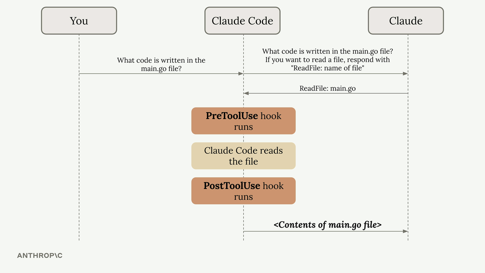
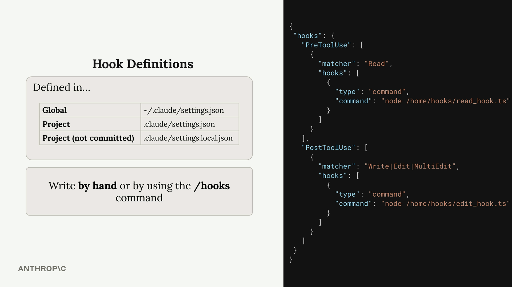
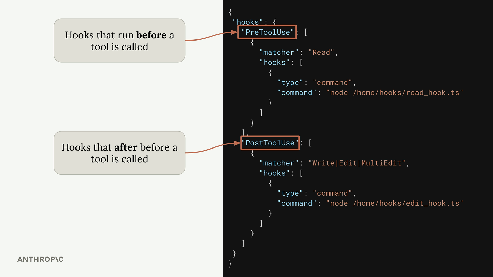
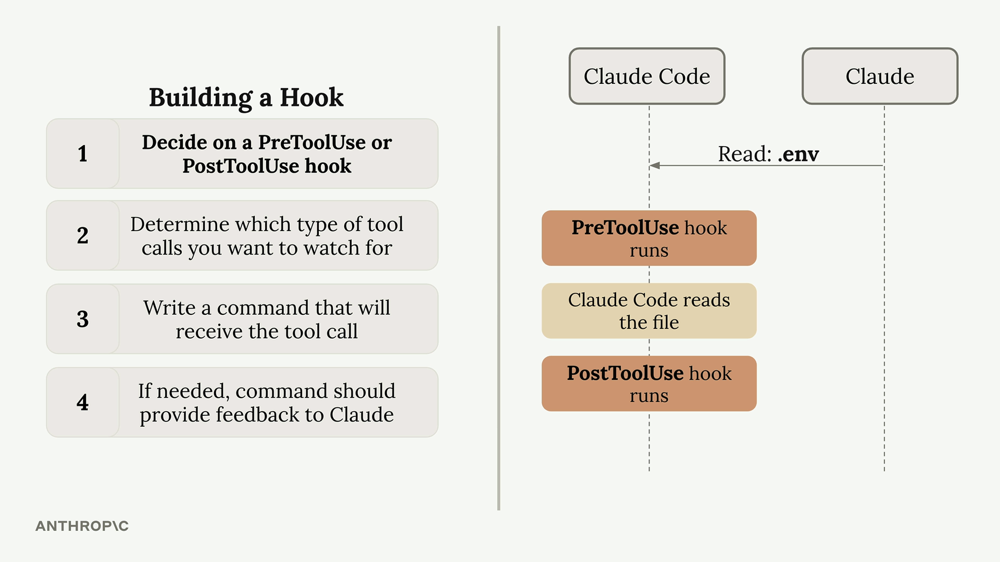
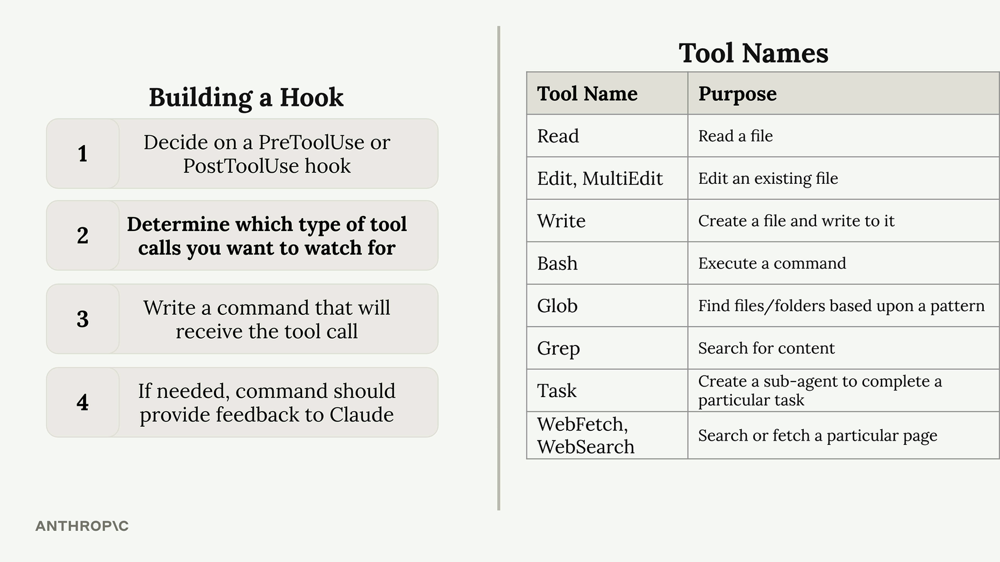
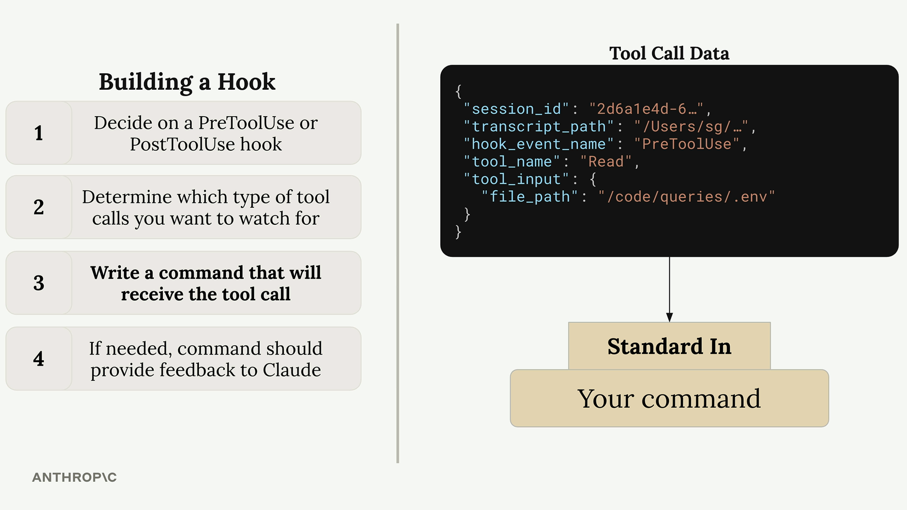
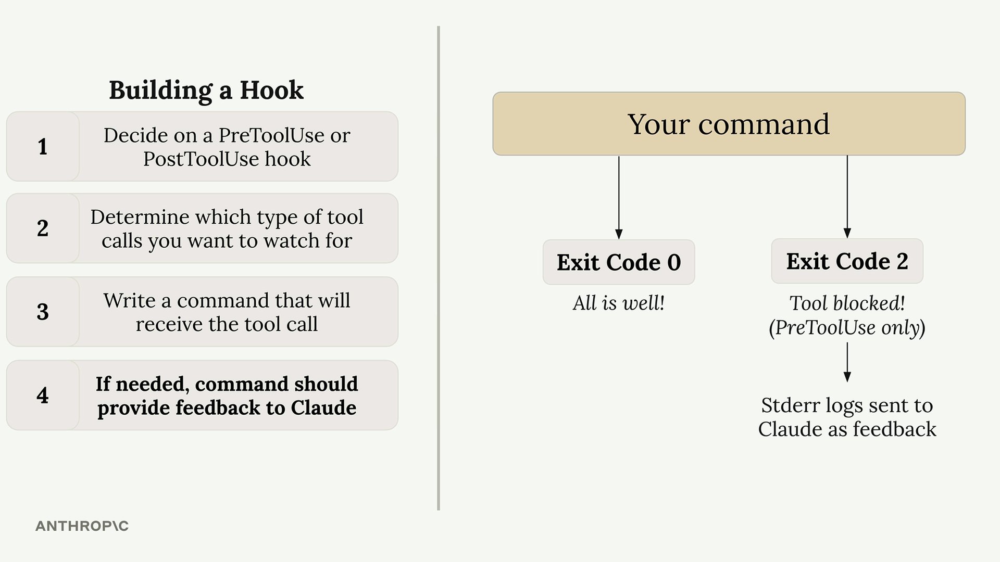
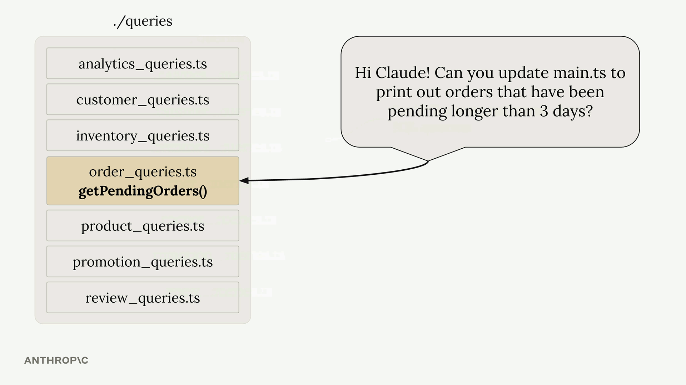
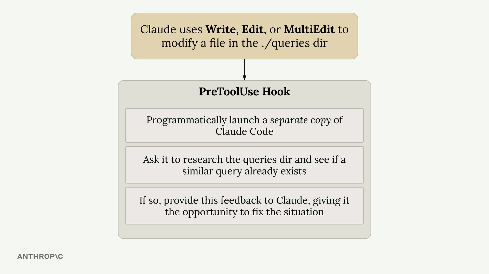

# Hook

## Cách Hooks Hoạt Động

Để hiểu hooks, trước tiên hãy xem lại flow thông thường khi bạn tương tác với Claude Code. Khi bạn hỏi Claude điều gì đó, query của bạn sẽ được gửi đến model Claude cùng với các tool definition. Claude có thể quyết định sử dụng một tool bằng cách cung cấp một response được format sẵn, sau đó Claude Code thực thi tool đó và trả về kết quả.

Hooks chen vào trong quá trình này, cho phép bạn thực thi code ngay trước hoặc ngay sau khi tool execution xảy ra.


Hai hook type phổ biến nhất được liệt kê dưới đây (bạn sẽ thấy các hook khác trong bài học sau):

- **PreToolUse hooks** – Chạy trước khi một tool được gọi
- **PostToolUse hooks** – Chạy sau khi một tool được gọi

## Cấu Hình Hook

Hooks được định nghĩa trong các file settings của Claude. Bạn có thể thêm chúng vào:

- **Global** – `~/.claude/settings.json` (áp dụng cho tất cả project)
- **Project** – `.claude/settings.json` (chia sẻ với cả team)
- **Project (not committed)** – `.claude/settings.local.json` (settings cá nhân)

Bạn có thể viết hooks thủ công trong các file này hoặc dùng lệnh `/hooks` bên trong Claude Code.




## Ứng Dụng Thực Tế

Dưới đây là một số cách phổ biến để sử dụng hooks:

- **Code formatting** – Tự động format file sau khi Claude chỉnh sửa
- **Testing** – Tự động chạy test khi file thay đổi
- **Access control** – Chặn Claude đọc hoặc chỉnh sửa các file cụ thể
- **Code quality** – Chạy linter hoặc type checker và cung cấp feedback cho Claude
- **Logging** – Theo dõi những file Claude truy cập hoặc chỉnh sửa
- **Validation** – Kiểm tra naming convention hoặc coding standard

Điểm mấu chốt là hooks cho phép bạn mở rộng khả năng của Claude Code bằng cách tích hợp các tool và process của riêng bạn vào workflow. PreToolUse hooks giúp bạn kiểm soát những gì Claude có thể làm, trong khi PostToolUse hooks cho phép bạn nâng cao những gì Claude đã làm.

## Xây Dựng một Hook

### Bốn Bước Chính

1. **Chọn PreToolUse hay PostToolUse hook** — PreToolUse hooks có thể ngăn tool call thực thi, trong khi PostToolUse hooks chạy sau khi tool đã được dùng
2. **Xác định loại tool call muốn theo dõi** — Bạn cần chỉ định chính xác tool nào sẽ kích hoạt hook
3. **Viết command để nhận tool call** — Command này nhận JSON data về tool call được đề xuất qua standard input
4. **Nếu cần, command nên cung cấp feedback cho Claude** — Exit code của command cho Claude biết nên allow hay block thao tác đó

---


### Các Tool Có Sẵn

Claude Code cung cấp một số built-in tools mà bạn có thể theo dõi bằng hooks.

Để xem chính xác những tool nào có sẵn trong setup hiện tại của bạn, bạn có thể hỏi thẳng Claude. Điều này đặc biệt hữu ích vì các tool có thể thay đổi khi bạn thêm custom MCP servers.

---



### Cấu Trúc Tool Call Data

Khi hook command của bạn thực thi, Claude gửi JSON data qua standard input chứa thông tin chi tiết về tool call được đề xuất:



```json
{
  "session_id": "2d6a1e4d-6...",
  "transcript_path": "/Users/sg/...",
  "hook_event_name": "PreToolUse",
  "tool_name": "Read",
  "tool_input": {
    "file_path": "/code/queries/.env"
  }
}
```

Command của bạn đọc JSON này từ standard input, parse nó, rồi quyết định allow hay block thao tác dựa trên tên tool và các input parameter.

---

### Exit Codes và Control Flow



Hook command giao tiếp với Claude thông qua exit codes:

- **Exit Code 0** — Mọi thứ ổn, cho phép tool call tiếp tục
- **Exit Code 2** — Block tool call (chỉ dành cho PreToolUse hooks)

Khi bạn exit với code 2 trong một PreToolUse hook, bất kỳ error message nào bạn ghi vào standard error sẽ được gửi đến Claude như feedback, giải thích lý do tại sao thao tác bị chặn.

---

### Ví Dụ Thực Tế

Một use case phổ biến là ngăn Claude đọc các file nhạy cảm như file `.env`. Vì cả `Read` lẫn `Grep` tool đều có thể truy cập nội dung file, bạn sẽ muốn theo dõi cả hai loại tool và kiểm tra xem chúng có đang cố truy cập các file path bị hạn chế không.

Cách tiếp cận này giúp bạn kiểm soát hoàn toàn quyền truy cập file system của Claude, đồng thời cung cấp feedback rõ ràng về lý do tại sao một số thao tác bị hạn chế.

## Các Hook Nâng Cao

### Hook Kiểm Tra TypeScript Type

Một trong những hook hữu ích nhất giải quyết một vấn đề cơ bản: khi Claude chỉnh sửa function signature, nó thường không cập nhật tất cả những nơi gọi function đó trong project.

Ví dụ, nếu bạn yêu cầu Claude thêm parameter `verbose` vào một function trong `schema.ts`, nó sẽ cập nhật thành công định nghĩa function nhưng bỏ sót call site trong `main.ts`. Điều này tạo ra type errors mà Claude không phát hiện ngay.

Giải pháp là một PostToolUse hook chạy TypeScript compiler sau mỗi lần edit file:

- Chạy `tsc --noEmit` để kiểm tra type errors
- Capture các lỗi tìm được
- Đưa lỗi ngay lập tức về cho Claude
- Nhắc Claude fix các vấn đề trong các file khác

Hook này hoạt động với bất kỳ typed language nào có thể chạy type checker. Với các untyped language, bạn có thể triển khai chức năng tương tự bằng automated tests.

---

### Hook Ngăn Duplicate Query

Trong các project lớn với nhiều database query, Claude đôi khi tạo ra duplicate functionality thay vì tái sử dụng code sẵn có. Điều này đặc biệt nghiêm trọng khi bạn giao cho Claude các task phức tạp, nhiều bước mà trong đó database operation chỉ là một thành phần nhỏ.

Hãy xét một project có nhiều query file, mỗi file chứa nhiều SQL function. Khi bạn yêu cầu Claude *"tạo Slack integration để cảnh báo về các order chờ xử lý quá 3 ngày"*, nó có thể viết một query mới thay vì dùng function `getPendingOrders()` có sẵn.



Hook ngăn duplicate query giải quyết vấn đề này bằng cách triển khai một review process:



Here's how it works:

- Kích hoạt khi Claude chỉnh sửa file trong thư mục `./queries`
- Khởi chạy một instance Claude Code riêng theo cách lập trình
- Yêu cầu instance thứ hai review các thay đổi và kiểm tra xem có query tương tự đã tồn tại không
- Nếu phát hiện duplicate, gửi feedback về cho instance Claude gốc
- Nhắc Claude xóa duplicate và dùng functionality đã có sẵn

---

### Cân Nhắc Khi Triển Khai

Cả hai hook đều dùng hệ thống PreToolUse hoặc PostToolUse. TypeScript hook tương đối nhẹ và chạy nhanh. Query duplication hook tốn nhiều tài nguyên hơn vì nó khởi chạy một Claude instance riêng cho mỗi lần review.

Với query hook, hãy cân nhắc các trade-off sau:

| | |
|---|---|
| **Lợi ích** | Codebase sạch hơn, ít duplicate hơn |
| **Chi phí** | Tốn thêm thời gian và API usage cho mỗi lần edit thư mục query |
| **Khuyến nghị** | Chỉ monitor các thư mục quan trọng để giảm thiểu overhead |

Các hook này dùng **Claude's Agent SDK** để tương tác lập trình với AI — cho phép tạo ra các workflow phức tạp, trong đó một Claude instance có thể review và cung cấp feedback cho công việc của instance khác.

---

### Mở Rộng Các Khái Niệm Này

Các hook trên minh họa những nguyên tắc rộng hơn mà bạn có thể áp dụng cho project của mình:

- Dùng output của compiler/linter để cung cấp feedback ngay lập tức
- Triển khai code review process bằng các AI instance riêng biệt
- Tập trung monitoring vào các thư mục quan trọng nơi tính nhất quán cần được đảm bảo
- Cân bằng giữa lợi ích của automation và chi phí về performance

Điều quan trọng là xác định các pain point cụ thể trong development workflow của bạn và tạo ra các hook có mục tiêu rõ ràng để tự động giải quyết những vấn đề đó.